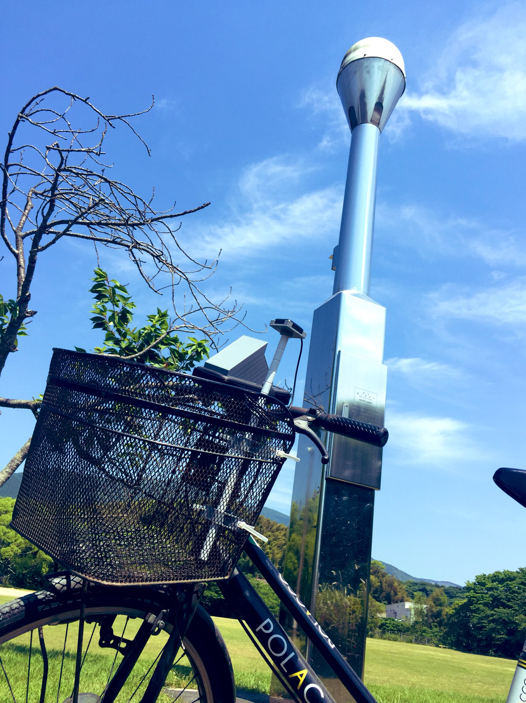
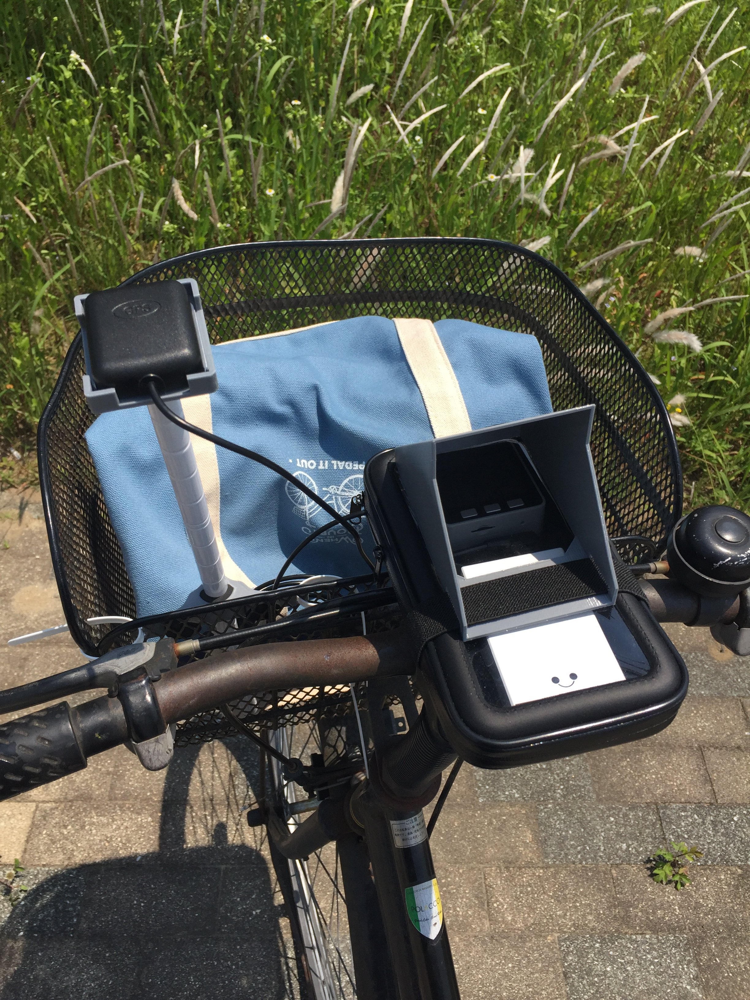
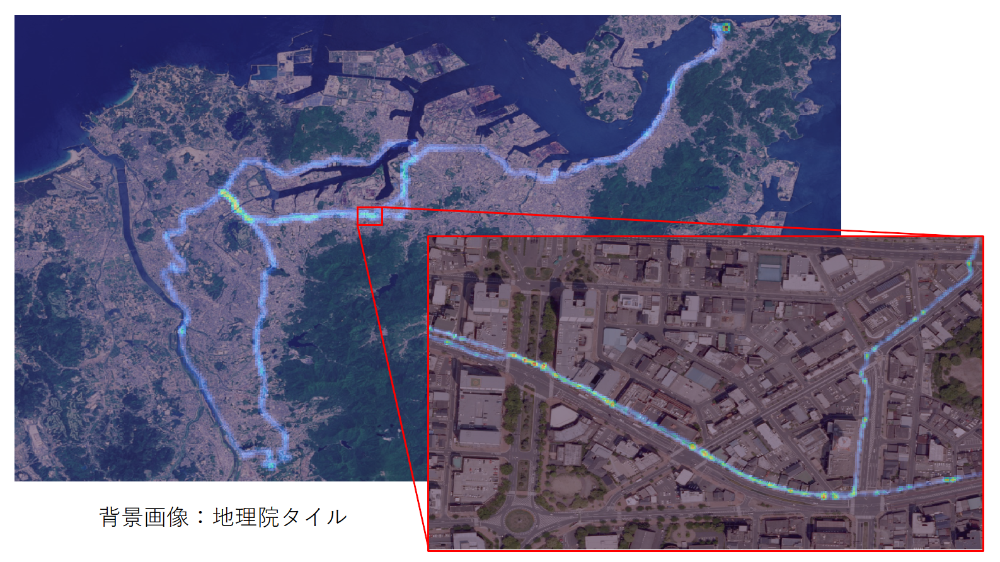

# MMS-Cycle
本リポジトリは簡易路面計測車両の開発リポジトリです．  
自転車走行による段差等の地理空間情報の収集を目的としています．  
計測範囲を拡大してデータの充実を図る等，順次アップデート予定です．  
なお，本コンテンツを利用して生じた損害について一切保証いたしかねます．  
予めご了承いただきますようお願い申し上げます．

   

# DEMO
## Foliumを用いた段差マップ
段差マップはHTMLファイルとして出力されるため，ブラウザ上での閲覧が可能です．  
[コチラ](https://uma919.github.io/MMS-Cycle-Demo/)でご覧いただけます．

## QGISを用いた段差マップ  
出力された[CSVファイル](./src/DataEditor/output/output.csv)を[QGIS](https://qgis.org/ja/site/index.html)により可視化することが可能です．  
    

# S/W
## Requirement
### Arduino
* [M5Stack Library](https://github.com/m5stack/M5Stack)
* [TinyGPS++](http://arduiniana.org/libraries/tinygpsplus/)
### Python
* [Folium](https://python-visualization.github.io/folium/)

## Data Logger (Arduino)
GNSS(GPS)より得られる位置情報や慣性情報をCSVファイルに逐次(0.1秒毎)書き込みます．  
下記のプログラムはM5Stack社の[サンプルプログラム](https://github.com/m5stack/M5Stack/blob/master/examples/Modules/GPS_NEO_M8N/FullExample/FullExample.ino)を参考にしております．  
* [ソースプログラム](./src/DataLogger/main/main.ino)  
* 出力ファイル例    
    * [北九州市 洞海湾 湾岸部](./src/DataEditor/input/data_20220515.csv)
    * [北九州市 八幡西～八幡東～戸畑～小倉北～門司](./src/DataEditor/input/data_20220522.csv)  
    * [北九州市～中間市～直方市](./src/DataEditor/input/data_20220529.csv)  

※ヘッダ情報は書き込みまないようにしているため，[ソースプログラム](./src/DataLogger/main/main.ino)でご確認ください．

## Data Editor (Python)
上記Data Loggerにおいて緯度経度(1s)と角速度(100ms)の取得間隔の差異が伴うため，緯度経度について内挿を施します．また，[入力ファイル用フォルダ](./src/DataEditor/input/)内の複数回の計測データを一つのCSVファイルとして統合します．加えて，ブラウザ上での段差マップの閲覧を目的として，Foliumライブラリを活用したHTMLファイルの自動作成機能を実装しています．  
* [ソースプログラム](./src/DataLogger/main/main.ino) 
* 出力ファイル例
    * [CSVファイル](./src/DataEditor/output/output.csv)  
    * [HTMLファイル](./src/DataEditor/output/index.html)

## Data Viewer (Python)
段差マップの閲覧のみを目的としたプログラムです(開発中)．  

# H/W
## Parts List
* 電装部品
    * [M5Stack Gray](https://www.switch-science.com/catalog/3648/) 1個
    * [M5Stack用GPSモジュール V2](https://www.switch-science.com/catalog/3861/) 1個
    * 東芝 Micro SDカード 8GB 1個
    * [cheero Canvas 3200mAh IoT 機器対応](https://cheero.shop/products/che-061) 1個 1個
    * Seria 3A Type-C L字充電ケーブル 70cm 1個
* 筐体部品等
    * ダイソー スマホホルダー(自転車用，タッチ操作可能) 1個
    * [ダイソー ポール(39cm，白)](https://jp.daisonet.com/products/4549131727975?_pos=8&_sid=3f94a06ba&_ss=r) 1個
    * [ダイソー マグネット補助プレート(粘着，2枚)](https://jp.daisonet.com/products/4550480032818?_pos=161&_sid=c878fe25d&_ss=r) 1個
    * [ダイソー 繰り返し使える抗菌結束バンド(白，15cm，15本)](https://jp.daisonet.com/products/4549131993233?_pos=30&_sid=32464de24&_ss=r) 4個
    * ダイソー (４本) べんりベルト 1個
    * [光 スポンジクッション[KSR-22]](https://www.monotaro.com/p/8625/2093/) 4個
    * [和気産業 ポロンスポンジ 粘着付 厚さ5mm×縦30mm×横300mm](https://axel.as-1.co.jp/asone/d/63-1532-72/) 1個
    * [3Dプリンタ出力部品](./stl)
