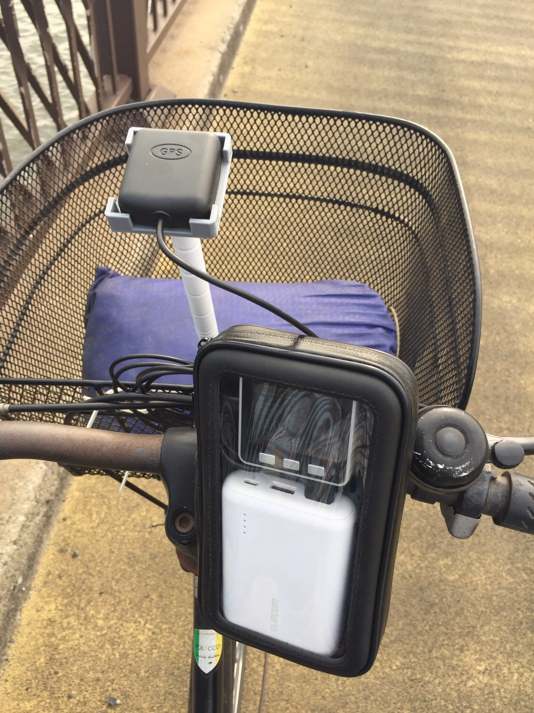
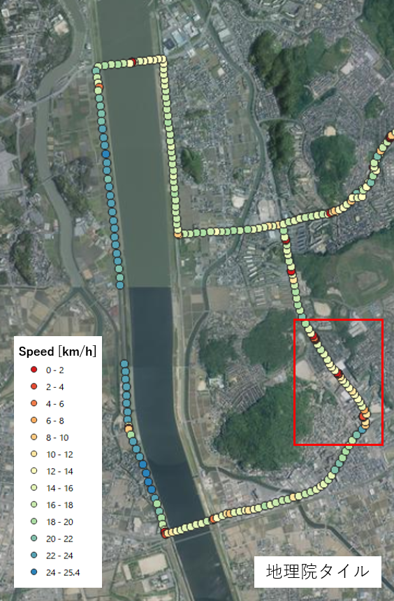
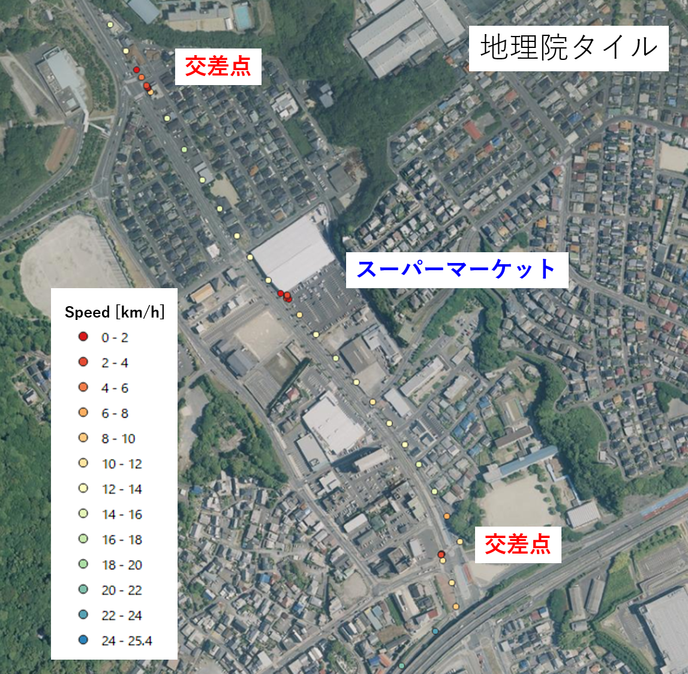

# MMS-Cycle
本リポジトリは簡易路面計測車両の開発リポジトリです．  
自転車走行により段差等の地理空間情報の収集を目的としています．  

  

# DEMO
交差点・立ち寄り場所を[QGIS](https://qgis.org/ja/site/index.html)で可視化  

 
  

順次アップデート予定です．  

# S/W
## Requirement
* [M5Stack Library](https://github.com/m5stack/M5Stack)
* [TinyGPS++](http://arduiniana.org/libraries/tinygpsplus/)

## Example
GNSS(GPS)より得られる位置情報や走行速度情報をCSVファイルに逐次(10秒毎)書き込みます．  
下記のプログラムはM5Stack社の[サンプルプログラム](https://github.com/m5stack/M5Stack/blob/master/examples/Modules/GPS_NEO_M8N/FullExample/FullExample.ino)を参考にしております．  
[GPS Data Logger](./src/DataLogger/main/main.ino)  

# H/W
## Parts List
* 電装部品
    * [M5Stack Gray](https://www.switch-science.com/catalog/3648/) 1個
    * [M5Stack用GPSモジュール V2](https://www.switch-science.com/catalog/3861/) 1個
    * 東芝 Micro SDカード 8GB 1個
    * [エレコム モバイルバッテリー[EC-M01WH]](https://www.elecom.co.jp/products/EC-M01WH.html) 1個
    * Seria 3A Type-C L字充電ケーブル 70cm 1個
* 筐体部品等
    * [ダイソー ポール(39cm，白)](https://jp.daisonet.com/products/4549131727975?_pos=8&_sid=3f94a06ba&_ss=r) 1個
    * [ダイソー マグネット補助プレート(粘着，2枚)](https://jp.daisonet.com/products/4550480032818?_pos=161&_sid=c878fe25d&_ss=r) 1個
    * [ダイソー 繰り返し使える抗菌結束バンド(白，15cm，15本)](https://jp.daisonet.com/products/4549131993233?_pos=30&_sid=32464de24&_ss=r) 4個
    * [光 スポンジクッション[KSR-22]](https://www.monotaro.com/p/8625/2093/) 4個
    * [和気産業 ポロンスポンジ 粘着付 厚さ5mm×縦30mm×横300mm](https://axel.as-1.co.jp/asone/d/63-1532-72/) 1個
    * [3Dプリンタ出力部品](./stl)