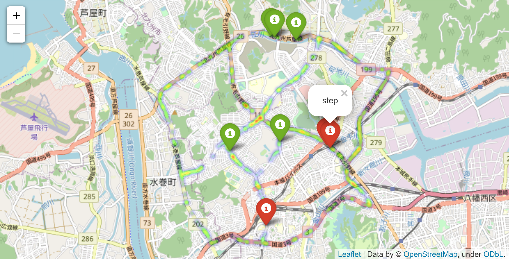
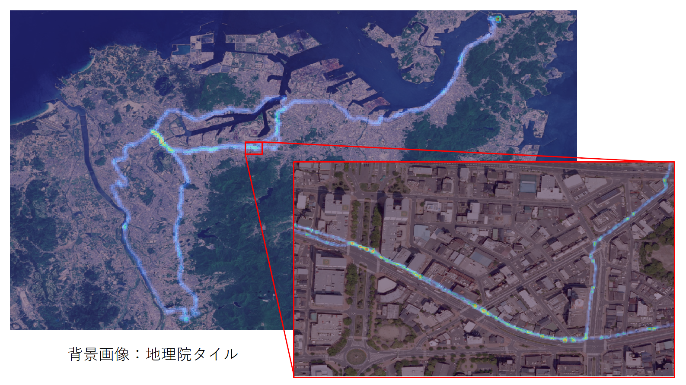
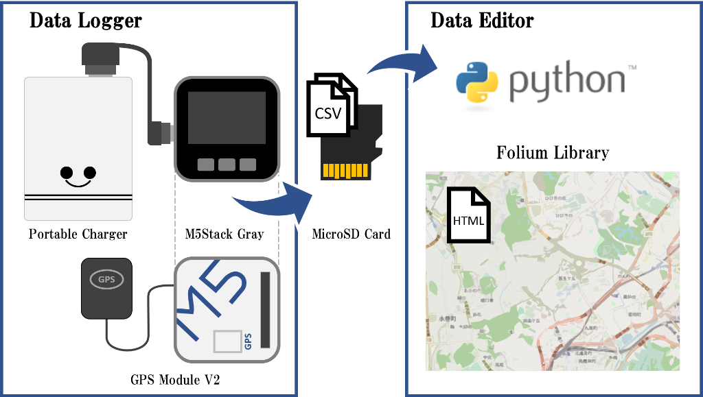

# RoVi: Road Visualizer
本リポジトリは道路可視化システムの開発リポジトリです．  
段差等の地理空間情報の収集および可視化を目的としています．  
自転車走行による道路の路面状態の自動計測やボタン押下による段差地点・除草要請地点の手動記録を実現しました．  
なお，本コンテンツを利用して生じた損害について一切保証いたしかねます．予めご了承いただきますようお願い申し上げます．  

紹介動画は下記サムネイルをクリック！  

# DEMO (RoViマップ)
RoViマップはHTMLファイルとして出力されるため，ブラウザ上での閲覧が可能です．  
[コチラ](https://uma919.github.io/RoVi-Demo/)からご覧いただけます．  
  
  
# Features
段差情報の収集において，自転車を使用することにしました．自転車は当然ながら路面と常時接地しており，その路面状態に応じた振動が伝わるためです．段差判定についてはピッチ角方向の回転により評価しました．  
  

参考までにGISソフトウェア「QGIS」を用いてピッチ角方向の角加速度データをマッピングした結果は下記の通りです．
  

# System Configuration  

# S/W
## Requirement
### Arduino
* [M5Stack Library](https://github.com/m5stack/M5Stack)
* [TinyGPS++](http://arduiniana.org/libraries/tinygpsplus/)
### Python
* [Folium](https://python-visualization.github.io/folium/)

## Data Logger (Arduino)
GNSS(GPS)より得られる位置情報や慣性情報をCSVファイルに逐次(0.1秒毎)書き込みます． 
また，ボタン押下により段差地点・除草要請地点の手動記録が可能です．
なお，下記のプログラムはM5Stack社の[サンプルプログラム](https://github.com/m5stack/M5Stack/blob/master/examples/Modules/GPS_NEO_M8N/FullExample/FullExample.ino)を参考にしております．  
* [ソースプログラム](./src/DataLogger/main/main.ino)  
* 出力ファイル(新仕様)
    * 慣性計測データ
        * [内環状ルート　北九州市](./src/DataEditor/input/sens_063625.csv)
        * [外環状ルート　北九州市・遠賀郡水巻町](./src/DataEditor/input/sens_190754.csv)
        * [本城～ひびきの　北九州市](./src/DataEditor/input/sens_204442.csv)
        * [ひびきの～水巻　北九州市・遠賀郡水巻町](./src/DataEditor/input/sens_211949.csv)
        * [折尾～浅川　北九州市](./src/DataEditor/input/sens_220312.csv)
    * 手動記録データ
        * [内環状ルート　北九州市](./src/DataEditor/input/repo_063625.csv)
        * [外環状ルート　北九州市・遠賀郡水巻町](./src/DataEditor/input/repo_190754.csv)
        * [本城～ひびきの　北九州市](./src/DataEditor/input/repo_204442.csv)
        * [ひびきの～水巻　北九州市・遠賀郡水巻町](./src/DataEditor/input/repo_211949.csv)
        * [折尾～浅川　北九州市](./src/DataEditor/input/repo_220312.csv)
* 出力ファイル(旧仕様)    
    * [北九州市 洞海湾 湾岸部](./src/DataEditor/_input/data_20220515.csv)
    * [北九州市 八幡西～八幡東～戸畑～小倉北～門司](./src/DataEditor/_input/data_20220522.csv)  
    * [北九州市～中間市～直方市](./src/DataEditor/_input/data_20220529.csv)
    * [北九州市 学研都市 環状ルート](./src/DataEditor/_input/data_20220604.csv)  

※ヘッダ情報は書き込みまないようにしているため，[ソースプログラム](./src/DataLogger/main/main.ino)をご確認ください．

## Data Editor (Python)
上記Data Loggerにおいて緯度経度(1s)と角速度(100ms)の取得間隔の差異が伴うため，緯度経度について内挿を施します．また，[入力ファイル用フォルダ](./src/DataEditor/input/)内の複数回計測データのCSVファイルを一つのCSVファイルとして統合します．加えて，ブラウザ上でのRoViマップの閲覧を目的として，Foliumライブラリを活用したHTMLファイルの自動作成機能を実装しています．  
* [ソースプログラム](./src/DataEditor/main/main.py) 
* 出力ファイル例
    * [慣性計測データ](./src/DataEditor/output/output_sensor.csv)
    * [手動記録データ](./src/DataEditor/output/output_report.csv)  
    * [HTMLファイル](./src/DataEditor/output/index.html) 

# H/W
## Parts List
* 電装部品
    * [M5Stack Gray](https://www.switch-science.com/catalog/3648/) 1個
    * [M5Stack用GPSモジュール V2](https://www.switch-science.com/catalog/3861/) 1個
    * 東芝 Micro SDカード 8GB 1個
    * [cheero Canvas 3200mAh IoT 機器対応](https://cheero.shop/products/che-061) 1個 1個
    * Seria 3A Type-C L字充電ケーブル 70cm 1個
* 筐体部品等
    * ダイソー スマホホルダー(自転車用，タッチ操作可能) 1個
    * [ダイソー ポール(39cm，白)](https://jp.daisonet.com/products/4549131727975?_pos=8&_sid=3f94a06ba&_ss=r) 1個
    * [ダイソー マグネット補助プレート(粘着，2枚)](https://jp.daisonet.com/products/4550480032818?_pos=161&_sid=c878fe25d&_ss=r) 1個
    * [ダイソー 繰り返し使える抗菌結束バンド(白，15cm，15本)](https://jp.daisonet.com/products/4549131993233?_pos=30&_sid=32464de24&_ss=r) 4個
    * ダイソー (４本) べんりベルト 1個
    * [光 スポンジクッション[KSR-22]](https://www.monotaro.com/p/8625/2093/) 4個
    * [和気産業 ポロンスポンジ 粘着付 厚さ5mm×縦30mm×横300mm](https://axel.as-1.co.jp/asone/d/63-1532-72/) 1個
    * [3Dプリンタ出力部品](./stl)
